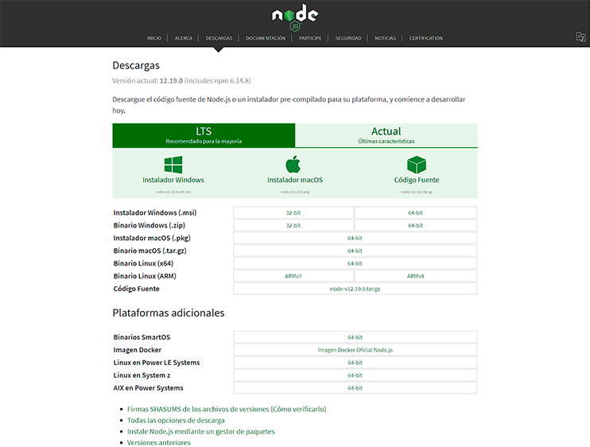

# Angular-Electron-App

   

Multiplatform desktop app based on Web technologies using Windows Operating System.

## Content table

- **[Benefits of using these tools](#Benefits-of-using-these-tools)**
  - *[Windows](#-Windows)*
  - *[Electron](#-Electron)*
  - *[Angular](#-Angular)*
  - *[NodeJS](#-NodeJS)*
- **[How to run the App](#How-to-run-the-App)**

## Benefits of using these tools

Desktop and web developers can be unified using Electron, the framework that gives the possibility to build native multi-platform desktop apps using web technology.
By making this small project we are going to end up in an useful knowledge, helpful in a real-life project.

###  Windows

Not the faster OS but the one with the most robust infrastructure, backed up with a multimillionaire company like microsoft who gives us the easiest way to integrate all these technologies.

###  Electron

Basically Electron's job to make our pc capable to run a website in a desktop window, in other words, what we are about to build is a website (html, css and javascript) inside a desktop window.

###  Angular

We need to be able to run a modularize UI and Angular helps doing it easier to us.

###  NodeJS

This is a run-time environment where all the previously seen technologies gets unified.

## How to run the App

before running this App we need to install some dependencies as:

- Install nodejs by clickin the following [Link](https://nodejs.org/es/download/) and follow the instructions.

- Once nodejs is installed open the cmd (win+r and type cmd and then press enter).

 

- Install npm by typing inside the cmd window:

>npm install npm@latest -g

- Now install electron by typing:

>npm i -D electron@latest

If it does not work try with any of these ones.

>npm i -D electron@beta

or

>npm i -D electron-nightly

Or run this command

>npm cache clean --force

And then try it again

- Now, to install Angular type:

>npm install -g @angular/cli

- If you don't have git, follow the next [Link](https://git-scm.com/) and install it by following the instructions.

- Open git bash and type:

>`https://github.com/jose-prieto/Angular-Electron-App.git`

Then

>cd Angular-Electron-App

And then

>git init

- Finally install electron locally to get de "node_modeles" directory to run correctly the App by typing:

>npm install electron --save-dev

- Now run it by typing

>npm run electron

## Done

